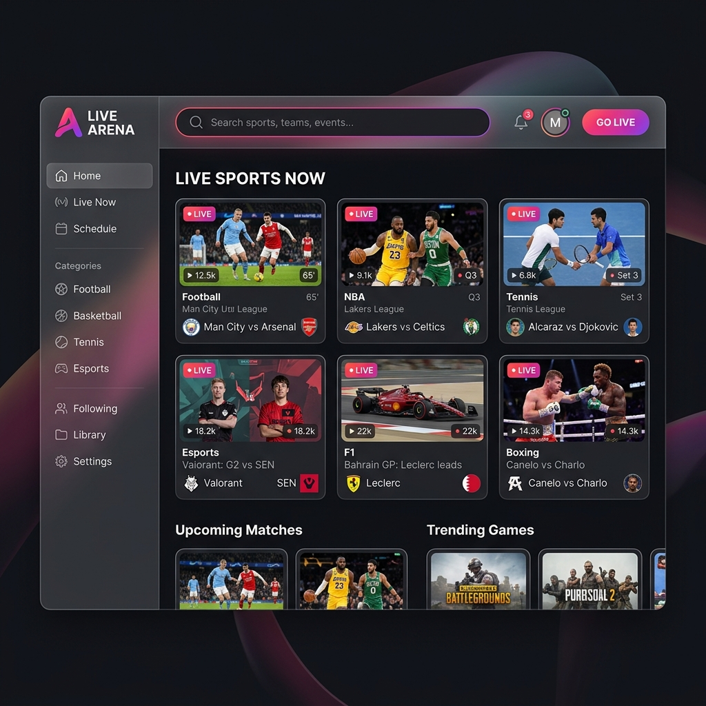

# Premium IPTV Sports Streaming Platform

## Overview
A state-of-the-art, YouTube-style web application designed for live IPTV and sports streaming. Built with modern web technologies, this platform natively plays `.m3u8` HLS streams directly in the browser, providing a seamless viewing experience.

The interface boasts a premium "Dark Mode" aesthetic with glassmorphism effects, dynamic CSS animations, and a responsive layout that adapts flawlessly to any screen size.

## Features
- 📺 **HLS Video Playback**: Integrated with `hls.js` for robust, cross-browser support of live `.m3u8` streams.
- 🎨 **Premium UI/UX**: Dark mode by default, featuring a vibrant color palette, floating labels, and 3D glassmorphic panels.
- 📜 **YouTube-Style Layout**: Includes a collapsible sidebar, a dynamic video grid (Home View), and a dedicated player interface (Watch View).
- 🔄 **Playlist Queue**: Instantly swap between live streams using the integrated "Up Next" queue without reloading the page.
- 🔐 **Authentication System**: Sleek Login and Registration forms with real-time validation and error handling, ready to connect to a Node.js/PostgreSQL backend.

## Tech Stack
- **HTML5**: Semantic and accessible structure.
- **Vanilla CSS3**: Custom styles, CSS variables, flexbox/grid layouts, and keyframe animations (No external CSS frameworks required).
- **Vanilla JavaScript**: Dynamic DOM manipulation, state management, and `fetch` API integration for backend connectivity.
- **HLS.js**: Open-source JavaScript library for playing HTTP Live Streaming (HLS) formats.

## Getting Started
Simply clone this repository and open `index.html` (Authentication) or `home.html` (Streaming Platform) in any modern web browser. No build steps are required for the frontend!
